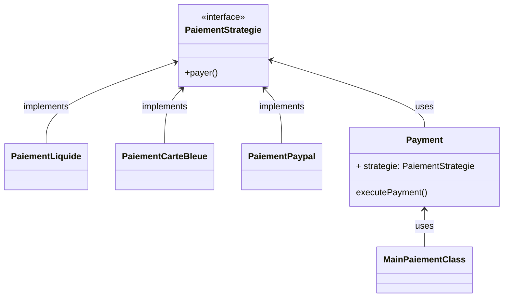

# specification_fonctionnelle_technique_Groupe_5
## Présentation des Design patterns Façade et Strategie
### Qu'est ce qu'un Design pattern ?

Le design pattern aussi appellé `modèle de conception` constitue un élémet primaire dans la programmation orienté objet.

Les Design patterns ont été crée du fait que les développeurs ont fait face à des problèmes de conception récurents et similaires.

### Voici les Designs patterns que nous verrons et à quoi ils servent :

| Nom  | Utilisation |
|---|---| 
| Façade | --|
| Strategie | Il permet de permuter des méthodes dans une application. Le tout est encapsulé en tant qu'objet et sont interchangeables. Cela fonctione comme un `switch` qui laisse la liberté au algorithmes de permuter en fonction des utilisateurs qui les emplois.|


#### Le modèle de conception Stratégie :

Voici un prototype d'utilisation de ce Design pattern :

#### Implémentation :

On crée tout d'abord `l'Interface` du type de Paiement :

Rien de bien compliqué
```java
    public interface PaiementStrategie {

    void pay();
}
```

On crée ensuite toute les classes des méthodes de paiement qui implémente `PaiementStratégie` précédemment crée.

```java
public class PaiementCarteBleue implements PaiementStrategie{
    @Override
    public void pay() {
        System.out.println("Paiement en CB effectué avec succès");
    }
}

public class PaiementPaypal implements PaiementStrategie{

    @Override
    public void pay() {
        System.out.println("Paiement Paypal effectué avec succès");
    }
}

public class PaiementLiquide implements PaiementStrategie{
    @Override
    public void pay() {
        System.out.println("Paiement en liquide accepté");
    }
}
```
Maintenant il nous reste la class `Payment` à crée qui permettra d'appeller les différentes méthodes de paiement.

```java
public class Payment {
    private PaiementStrategie strategie;

    public Payment(PaiementStrategie strategie) {
        this.strategie = strategie;
    }

    void excutePayment(){
        if (strategie == null){
            System.out.println("Aucun moyen de paiement n'a été défini");
            return;
        }
        strategie.pay();
    }

    public void setStrategie(PaiementStrategie strategie) {
        this.strategie = strategie;
    }
}

```

Puis on crée le Main : 
```java
public class Main {
    public static void main(String[] args) {
    Payment payment = new Payment(new PaiementPaypal());
    payment.excutePayment();

    payment.setStrategie(new PaiementCarteBleue());
    payment.excutePayment();

    payment.setStrategie(new PaiementLiquide());
    payment.excutePayment();

    payment.setStrategie(null);
    payment.excutePayment();
    }
}
```

L'exécution de ce code nous donne :

```html

[out]

Paiement Paypal effectué avec succès
Paiement en CB effectué avec succès
Paiement en liquide accepté
Aucun moyen de paiement n'a été défini

Process finished with exit code 0
```
